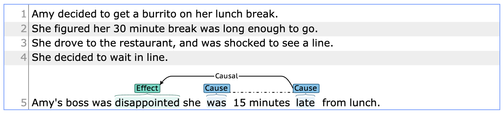

# CREST: A Causal Relation Schema for Text :rocket:

CREST is created to help researchers who work on causal/counterfactual relation extraction/classification, commonsense reasoning, and reading comprehension in natural language to communicate easier and leverage the scattered data resources around this topic. CREST is a user-friendly machine-readable format stored as pandas [DataFrame](https://pandas.pydata.org/pandas-docs/stable/reference/api/pandas.DataFrame.html).

### `CREST` convertion
We provide helper methods to convert CREST-formatted data to popular formats and annotation schemes, mainly formats that are used across relation extraction/classification tasks. In the following, there is a list of formats for which we have already developed CREST converter methods:
* `brat`: we have provided helper methods to convert CREST-formatted data frames to brat (brat to CREST converters will be added soon). [brat](https://brat.nlplab.org/) is a popular web-based annotation tool that has been used for a variety of relation extraction NLP tasks. We use brat for two main reasons: 1) better visualization of causal and non-causal relations and their arguments, and 2) modifying relations annotations if needed and adding new annotations to provided context. In the following, there is a sample of a converted version of CREST-formatted relation to brat (example is taken from CaTeRS dataset):
           

           
           

* `TACRED`: [TACRED](https://nlp.stanford.edu/projects/tacred/) is a large-scale relation extraction dataset. We convert samples from CREST to TACRED since TACRED-formatted data can be easily used as input to many transformers-based language models.

### Available Data Resources
List of data resources already converted to CREST format:

| Id | Data resource  | Samples | Causal | Non-causal | Availability |
| -- | -------------- | :----------: | :---------: | :-----------: | ------------ |
| 1 | SemEval 2007 task 4 | 1,529 | 114 | 1,415 | Public |
| 2 | SemEval 2010 task 8 | 10,717 | 1,331 | 9,386 | Public | 
| 3 | [EventCausality](https://cogcomp.seas.upenn.edu/page/resource_view/27) | 485 | 485 | - | Public |
| 4 | [Causal-TimeBank](https://hlt-nlp.fbk.eu/technologies/causal-timebank) | 318 | 318 | - | Not Public| 
| 5 | [EventStoryLine v1.5](https://github.com/tommasoc80/EventStoryLine) | 2608 | 2608 | - | Public | 
| 6 | [CaTeRS](https://www.cs.rochester.edu/nlp/rocstories/CaTeRS/) | 2502 | 308 | 2194 | Public | 
| 7 | [BECauSE v2.1](https://github.com/duncanka/BECAUSE) | 729 | 554 | 175 | Partially Public| 
| 8 | [Choice of Plausible Alternatives (COPA)](https://www.cs.york.ac.uk/semeval-2012/task7/index.php%3Fid=data.html) | 2000 | 1000 | 1000 | Public |

### How you can contribute:
* Are there any related datasets you don’t see in the list? Let us know or feel free to submit a `Pull Request (PR)`, we actively check the PRs and appreciate it :relaxed:
* Is there a well-known or widely-used machine-readable format you think can be added? We can add the helper methods for conversion or we appreciate PRs.

### How to cite CREST if you found it useful?
For now, you can cite this GitHub repository.
